# 项目说明

## 一，NiuTrans.NMT

### 1. 实验目的

+ 体验NiuTrans.NMT

### 2. 实验过程

+ 在NiuTrans.NMT中找到Translating的example

+ 在example最下方找到模型链接，本次实验使用的模型为iwlst14.en-de.ensemble；

+ 在NMT压缩包中找到训练数据集，本次实验使用的数据集为iwslt14.tokenized.de-en中的test.de

+ 根据说明改变参数，本次实验最终成功运行的参数为：

  ```txt
  -dev -1 -test C:\Users\lenovo-pc\GitHub\NiuTrans.NMT-master\sample\train\iwslt14.tokenized.de-en\iwslt14.tokenized.de-en\test.de  -model E:\硕士研究生\机器翻译\机器翻译\iwlst14.de-en.ensemble\iwlst14.en-de.ensemble\model.bin  -sbatch 64    -beamsize 1 -srcvocab E:\硕士研究生\机器翻译\机器翻译\iwlst14.de-en.ensemble\iwlst14.en-de.ensemble\vocab.de  -tgtvocab E:\硕士研究生\机器翻译\机器翻译\iwlst14.de-en.ensemble\iwlst14.en-de.ensemble\vocab.en  -output output.atat
  ```

+ 在NiuTrans.NMT中输入上面的参数并执行,

### 3. 实验结果

​	(1) 在参数设置的对应路径中生成output文件


 	(2) 下面是输出结果展示

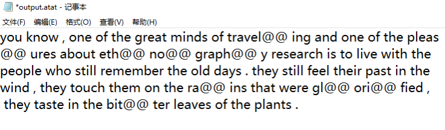

​	(3) 上述翻译的原文：

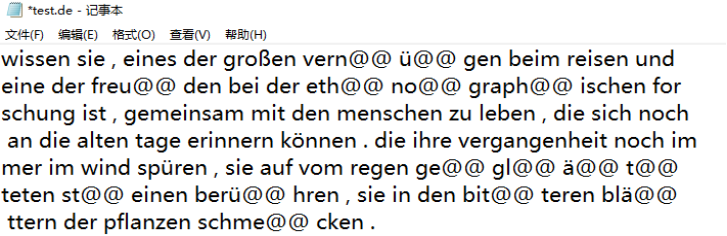

### 4、实验结果分析

**本实验重现了NMT里对Translating的样例，即实现了将给定数据集中的德语翻译成英语；但是未能对模型进一步优化，仅仅只是重现，而且并没有对实验结果进行评测。**


## 二，使用RNN训练语言模型—tensorflow

### 1. 实验代码分析设计：

#### 1) 实验准备阶段：

准备一个数据集，数据集中包含的内容为任意的一段文字，将该文字放到一个txt文档中，与程序的代码文件放在同一个文件夹下面。同时也要新建一个文件来保存实验过程中相关的参数，训练过程数据，训练结果图，测试的内容文本。

#### 2) 实验代码分析

**实验功能函数分析：**

```python
# 时间显示函数
def elapsed(sec):
    if sec < 60:
        return str(sec) + " sec"
    elif sec < (60 * 60):
        return str(sec / 60) + " min"
    else:
        return str(sec / (60 * 60)) + " hr"


# 中文多文件
def readalltxt(txt_files):
    labels = []
    for txt_file in txt_files:
        target = get_ch_lable(txt_file)
        labels.append(target)
    return labels

# 中文字 函数从文件里获取文本
def get_ch_lable(txt_file):
    labels = ""
    with open(txt_file, 'rb') as f:
        for label in f:
            labels = labels + label.decode('utf-8')
            # labels = labels + label.decode('gb2312')
    return labels

# 函数将文本数组转换成向量，优先转文件里的字符到向量
def get_ch_lable_v(txt_file, word_num_map, txt_label=None):
    words_size = len(word_num_map)
    to_num = lambda word: word_num_map.get(word, words_size)
    if txt_file != None:
        txt_label = get_ch_lable(txt_file)

    labels_vector = list(map(to_num, txt_label))
    return labels_vector
```

**实验相关参数，位置文件，参数配置**

```python
 # 训练集文件的名称，位置在同一个目录下
	tf.reset_default_graph()
    saveDir = "./result/test1"
	training_file = saveDir+'wordstest.txt'
	filename = saveDir+'testResult.txt'

    test_arr = ["学习党章", "深化改革"]
	
    # 定义参数

    learning_rate = 0.001  # 学习率
    training_iters = 200000  # 训练迭代次数

    display_step = 500  # 每多少次输出一下中间状态

    # 每输出4字来预测下一个字
    n_input = 4

    ##### 使用三层网络 LSTM_RNN 每一层的隐层节点数目

    n_hidden1 = 256
    n_hidden2 = 512
    n_hidden3 = 512
    
    # 定义占位符
    x = tf.placeholder("float", [None, n_input, 1])
    wordy = tf.placeholder("float", [None, words_size])

    x1 = tf.reshape(x, [-1, n_input])
    x2 = tf.split(x1, n_input, 1)
    
     # ### 保存相关参数信息
    with open(saveDir+"parameters.txt", mode="ta", encoding="GBK") as name:
        name.write("迭代相关参数\n")
        name.write("learning_Rate="+str(learning_rate) + "\n")
        name.write("train_iteration="+str(training_iters) + "\n")
        name.write("display_step="+str(display_step)+"\n")
        name.write("\n")
        name.write("三层LSTM隐层节点数目\n")
        name.write("layer1 = "+str(n_hidden1)+"\n")
        name.write("layer2 = "+str(n_hidden2)+"\n")
        name.write("layer3 = "+str(n_hidden3)+"\n")
        name.close()

```

**数据预处理**

```python
training_data = get_ch_lable(training_file)
    print("Loaded training data...")

    # 获取全部的字表words
    counter = Counter(training_data)
    words = sorted(counter)
    words_size = len(words)
    word_num_map = dict(zip(words, range(words_size)))

    # 生成样本向量wordlabel和与向量对应关系的word_num_map
    print('字表大小:', words_size)
    wordlabel = get_ch_lable_v(training_file, word_num_map)
```

**模型训练与优化**

```python
# 放入3层LSTM网络，最终通过一个全连接生成words_size个节点，为后面的softmax做准备
    # 2-layer LSTM，每层有 n_hidden 个units
    rnn_cell = rnn.MultiRNNCell([rnn.LSTMCell(n_hidden1), rnn.LSTMCell(n_hidden2), rnn.LSTMCell(n_hidden3)])

    # 通过RNN得到输出
    outputs, states = rnn.static_rnn(rnn_cell, x2, dtype=tf.float32)

    # 通过全连接输出指定维度
    pred = tf.contrib.layers.fully_connected(outputs[-1], words_size, activation_fn=None)

    # 优化器使用的是AdamOptimizer，loss使用的是softmax的交叉熵，正确率是统计one_hot中索引对应的位置相同的个数
    # 定义loss与优化器
    loss = tf.reduce_mean(tf.nn.softmax_cross_entropy_with_logits(logits=pred, labels=wordy))
    optimizer = tf.train.AdamOptimizer(learning_rate=learning_rate).minimize(loss)

    # 模型评估
    correct_pred = tf.equal(tf.argmax(pred, 1), tf.argmax(wordy, 1))
    accuracy = tf.reduce_mean(tf.cast(correct_pred, tf.float32))
```

**模型训练环节**

```python
# 训练中，在session中每次随机取一个偏移量，然后取后面4个文字向量当作输入，第5个文字向量当作标签用来计算loss


    if os.path.exists("./log/rnnword/"):
        shutil.rmtree("./log/rnnword")
        os.mkdir("./log/rnnword/")

    savedir = "log/rnnword/"
    saver = tf.train.Saver(max_to_keep=1)  # 生成saver

    # 启动session
    with tf.Session() as session:
        session.run(tf.global_variables_initializer())
        step = 0
        offset = random.randint(0, n_input + 1)
        end_offset = n_input + 1
        acc_total = 0
        loss_total = 0

        # 添加保存检查点功能
        kpt = tf.train.latest_checkpoint(savedir)
        print("kpt:", kpt)
        startepo = 0
        if kpt != None:
            saver.restore(session, kpt)
            ind = kpt.find("-")
            startepo = int(kpt[ind + 1:])
            print(startepo)
            step = startepo

        while step < training_iters:

            # 随机取一个位置偏移
            if offset > (len(training_data) - end_offset):
                offset = random.randint(0, n_input + 1)

            inwords = [[wordlabel[i]] for i in range(offset, offset + n_input)]  # 按照指定的位置偏移获得后4个文字向量，当作输入

            inwords = np.reshape(np.array(inwords), [-1, n_input, 1])

            out_onehot = np.zeros([words_size], dtype=float)
            out_onehot[wordlabel[offset + n_input]] = 1.0
            out_onehot = np.reshape(out_onehot, [1, -1])  # 所有的字都变成onehot

            _, acc, lossval, onehot_pred = session.run([optimizer, accuracy, loss, pred],
                                                       feed_dict={x: inwords, wordy: out_onehot})
            loss_total += lossval
            acc_total += acc
            if (step + 1) % display_step == 0:
                print("Iter= " + str(step + 1) + ", Average Loss= " + \
                      "{:.6f}".format(loss_total / display_step) + ", AverageAccuracy= " + \
                      "{:.2f}%".format(100 * acc_total / display_step))
                # 将准确率存放到数组中去，用于绘制图形
                AverageAccuracyList.append(100 * acc_total / display_step)

                save_accuracy_name= saveDir + "averageAccuracy.txt"


                with open(save_accuracy_name,mode='ta',encoding="GBK") as names:
                    names.write("iters:"+str(step+1)+",accuracy:"+str(100 * acc_total / display_step)+"%\n")
                    names.close()

                acc_total = 0
                loss_total = 0
                in2 = [words[wordlabel[i]] for i in range(offset, offset + n_input)]
                out2 = words[wordlabel[offset + n_input]]
                out_pred = words[int(tf.argmax(onehot_pred, 1).eval())]
                print("%s - [%s] vs [%s]" % (in2, out2, out_pred))
                saver.save(session, savedir + "rnnwordtest.cpkt", global_step=step)
            step += 1
            offset += (n_input + 1)  # 调整下一次迭代使用的偏移量

        print("Finished!")
        saver.save(session, savedir + "rnnwordtest.cpkt", global_step=step)
        print("Elapsed time: ", elapsed(time.time() - start_time))
```

**对模型训练过程中的准确率绘制折线图**

```python
		# 从图中可以看到随着训练轮数的增加，训练的准确率在逐步提升。

        a = range(len(AverageAccuracyList))

        plt.plot(a, AverageAccuracyList, label='AverageAccuracy', linewidth=3, color='r', marker='o',
                 markerfacecolor='blue', markersize=3)
        plt.xlabel('Plot Number')
        plt.ylabel('Important var')
        plt.title('Interesting Graph\nCheck it out')
        plt.legend()
        # plt.show()
        plt.savefig(saveDir + "result.png")
```

**数据测试阶段**

```python
		 # 对数据进行测试，输入n_input个字，收到输入的文本后，通过eval计算onehot_pred节点，
        # 并进行文字的转义，得到预测文字接下来将预测文字再循环输入模型中，预测下一个文字
        # 循环测试的次数
        count = 2

        while count > 0:
            prompt = "请输入%s个字: " % n_input
            # sentence = input(prompt)
            sentence = test_arr[len(test_arr) - count]
            inputword = sentence.strip()

            if len(inputword) != n_input:
                print("您输入的字符长度为：", len(inputword), "请输入4个字")
                continue
            try:
                inputword = get_ch_lable_v(None, word_num_map, inputword)
                for i in range(32):
                    keys = np.reshape(np.array(inputword), [-1, n_input, 1])

                    onehot_pred = session.run(pred, feed_dict={x: keys})
                    onehot_pred_index = int(tf.argmax(onehot_pred, 1).eval())
                    sentence = "%s%s" % (sentence, words[onehot_pred_index])
                    inputword = inputword[1:]
                    inputword.append(onehot_pred_index)
                # print(sentence)


                with open(filename, mode="ta", encoding="GBK") as name:
                    name.write(test_arr[len(test_arr) - count] + "\n")
                    name.write(sentence + "\n")
                    name.close()
                count = count - 1
            except:
                print("该字我还没学会")
                break
```

#### 3) 实验相关设置

本实验采用了不同的样本对算法的性能进行了测试，在算法中也包含了许多不同的参数，包括学习率，训练轮数，中途显示结果的轮数，输入字数个数，三层LSTM隐层节点数目。对于一组样本，我们改变一个参数，固定其他的参数进行测试。并且在相同的文本下对不同的参数进行了训练，测试了各个参数对于结果性能的影响。在此基础上，本文档选择了部分有较好性能的结果予以展示。

### 2. 实验结果展示

#### 1) 模型一实验结果分析

+ 使用的样本为：在尘世的纷扰中，只要心头悬挂着远方的灯光，我们就会坚持不懈地走，理想为我们灌注了精神的蕴藉。所以，生活再平凡、再普通、再琐碎，我们都要坚持一种信念，默守一种精神，为自己积淀站立的信心，前行的气力。
+ 在使用该样本对模型进行训练时，迭代次数设置为**20000**次，每迭代**500**次记录一次准确率的值。下面是随着迭代次数的增加，准确率的部分变化过程：

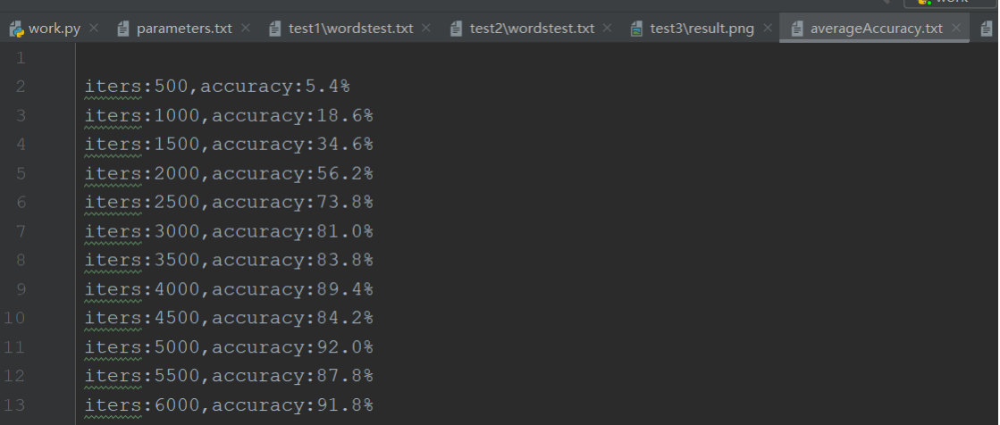


+ 为了直观表示准确率的走向，本次实验绘制了准确率走势的折线图

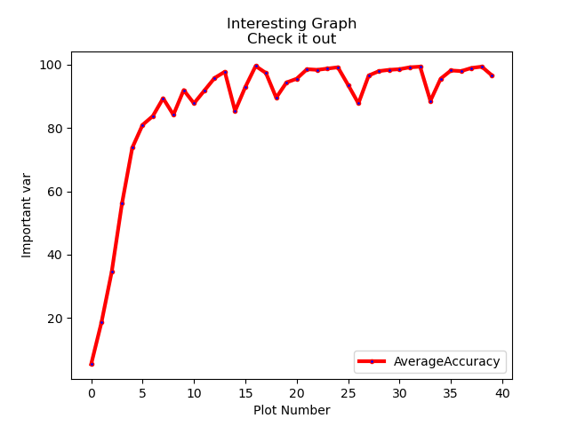

+ 使用本样本对模型训练，在**迭代20000次准确率达到了96.6%**，认为模型可用，开始使用该模型进行预测。
+ 本次实验中**使用该模型进行了两次预测，**向训练好的模型输入文字“坚持不懈”和“生活平凡”，模型相应的**预测结果**如下图。从预测结果看，模型准确率相对较高，但是模型不太稳定，因此在对文字进行预测时，虽然大致能看明白输出的语句是有一定逻辑的，但是还是不是完美的语句。

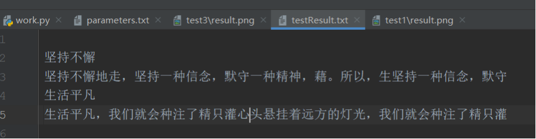

#### 2) 模型二实验结果分析

+ 使用的样本为：这里将整段文字都看成一个个的序列。在模型里预设值只关注连续的4个序列，这样在整段文字中，每次随意拿出4个连续的文字放到模型里进行训练，然后把第5个连续的值当成标签，与输出的预测值进行loss的计算，形成一个可训练的模型，通过优化器来迭代训练。
+ 在使用该样本对模型进行训练时，迭代次数设置为**20000**次，每迭代**500**次记录一次准确率的值。下面是随着迭代次数的增加，**准确率的部分变化过程**：

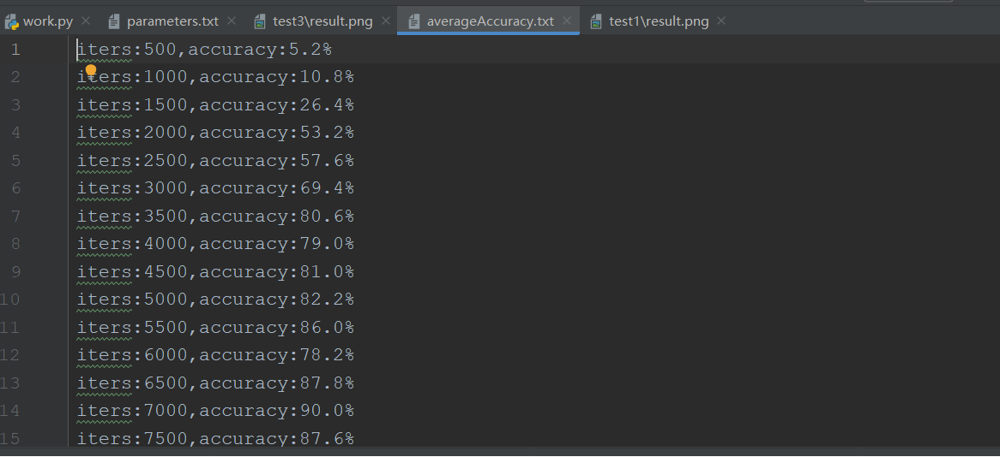 


+ 为了直观表示准确率的走向，本次实验绘制了**准确率走势的折线图**：

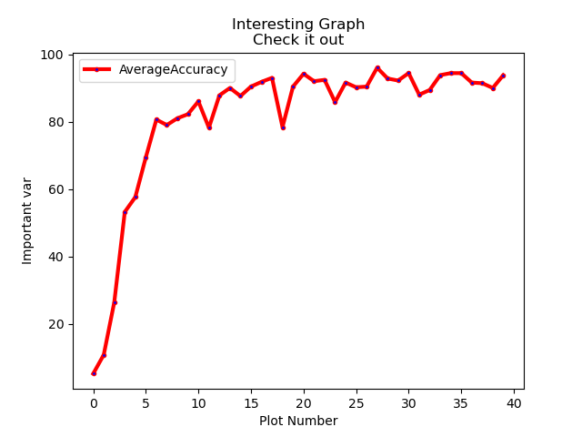 

 

+ 使用本样本对模型训练，在**迭代20000次准确率达到了93.8%**，认为模型可用，开始使用该模型进行预测。
+ 本次实验中**使用该模型进行了两次预测**，向训练好的模型输入文字“文字序列”和“模型训练”，模型相应的**预测结果**如下图。从预测结果看，模型准确率相对较高，但是模型不太稳定，因此在对文字进行预测时，虽然大致能看明白输出的语句是有一定逻辑的，但是还是不是完美的语句。但是与模型一相比，虽然准确率低，但是文字预测出的结果更接近人类语言。

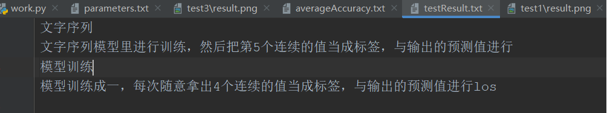 

#### 3) 模型三实验结果分析：

+ 使用的样本为：在思想上。在这段时间来，我再一次认真系统的学习了新党章、“三个代表”重要思想和科学发展观;深刻领会“十九大”会议精神，并充分认识到它们是改造客观世界，夺取社会主义现代化建设事业胜利果实的行动指南。经过这一系列的学习，我不断提高自我的政治思想水平，更加坚定了加入中国共产党的信念，并且懂得了理论上的成熟是政治上成熟的基础，政治上的清醒于稳固的理论基石。仅有坚定了共产主义信念，牢记全心全意为人民服务的宗旨，才能在这个风云变幻的国际环境中，在深化改革、扩大开放、大力发展市场经济的全新形势下，始终坚持党的基本路线不动摇，永远坚持一个党员应有的纯洁性和先进性。在工作上。作为一名入党进取分子，我时刻都严格要求自我，努力工作，不等不靠，在工作中我严格以党员的标准来要求自我，牢记入党誓词，克服并纠正自身存在的问题，工作中大胆负责，遇到困难挺身而出。牢记党对我的培养和教育，吃苦在前，享受在后，能够脚踏实地任劳任怨的工作，并能够根据实际情景合理做好前后保障工作，为我系的工作尽职尽责!另外在做好本职工作的同时能够虚心学习其它各相关专业，力求做到一专多能，以更好地为师生服务。在生活中。我认为:为师生服务不仅仅能够体此刻大事上，的是体此刻平常的一些细节上，平时不能不屑于做小事而在等做大事，人有云:一屋不扫何以扫天下所以要从小事做起，从身边做起。日常的生活中，我一向都以一个党员的标准严格要求自我，遵守国家法律法规，遵守社会公德，发挥党员的模范带头作用，进取团结同事，热心助人，主动帮忙其他同事做一些力所能及的事。作为在党的关心和培养下成长起来的消防员，单有一腔热血和为人民服务的热情是远远不够的，还需要有坚实的科学文化知识作为基础，所以，我进取的利用业余时间学习，以求不断的充实自我，加深理论文化知识，从而更好的为广大职工服务。以上便是我最近在思想、工作、学习等方面的汇报。在今后的日子里，我将努力完成党组织赋予我们这一代青年的使命，不断加强理论知识的学习，用科学的思想武装自我，对工作加倍认真负责，进一步加强党员先锋模范的带头作用，努力向先进党员同志看齐，不断完善自我，注重日常生活作风的养成，自觉做到在政治上、思想上、行动上与党中央坚持高度一致。相信只要我坚持要求提高，不懈学习，我必须能够得到党组织的认可。我愿意每时每刻理解考验，请党组织考验我吧!
+ 在使用该样本对模型进行训练时，迭代次数设置为**20000**次，每迭代**500**次记录一次准确率的值。下图是迭代20000次时准确率的折线图以及预测结果（经过实践，该样本下迭代20000次的最终准确率只有3.8%，效果太差，模型不可用，因此，使用这个不好的模型进行预测时，得到的是没有意义的语句）：

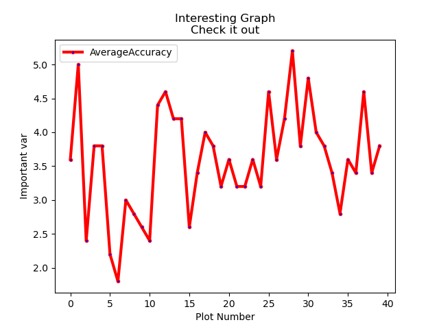 

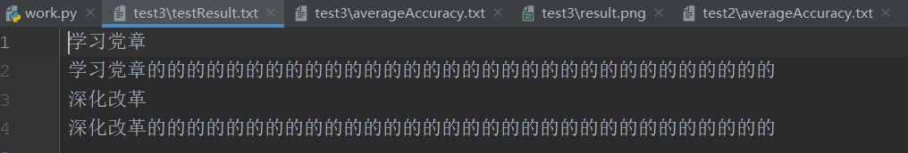 

+ 从上图明显可以发现，**在该样本下，准确率在5%以下，模型不可用，因此要重新训练模型，设置迭代次数为50000次**。
+ 下面是迭代次数为200000次，每500次记录一次准确率，随着迭代次数的增加，**准确率的部分变化过程**：

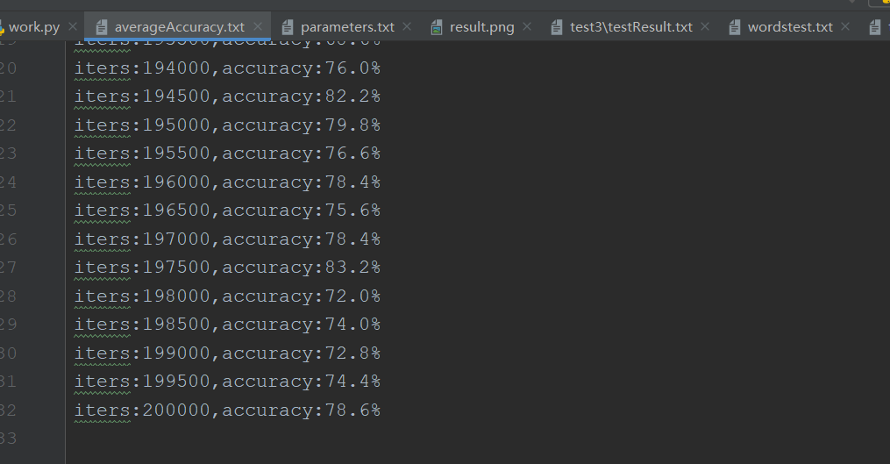 

+ 下图是迭代200000次时模型对应的**准确率的折线图**：

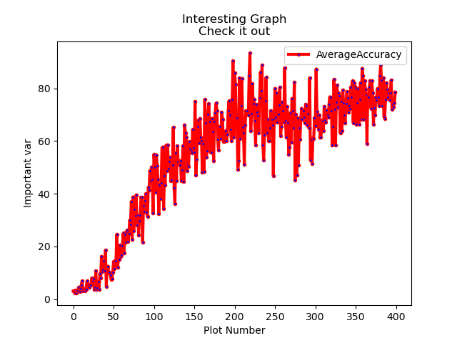 

 

+ **重新对模型进行训练，在迭代200000次准确率达到了78.6%**，认为模型可用，开始**使用该模型进行预测**。
+ 本次实验中使用该模型进行了**两次预测，**向训练好的模型输入文字“深化改革”和“学习党章”，模型相应的**预测结果**如下图。理论上讲，随着样本的增大，模型的准确率和稳定性较前两个模型应该有大幅度的提升，但是由于迭代次数没有足够大，没有将模型尽可能地训练好。考虑到现实因素，本次实验对于该模型只训练了两次，分别是迭代次数为20000次和200000次。对比来看，模型训练时迭代次数越多，模型的准确率越好，但是模型的性能还有较大的提升，考虑到现实因素，没有进一步对模型进行优化。

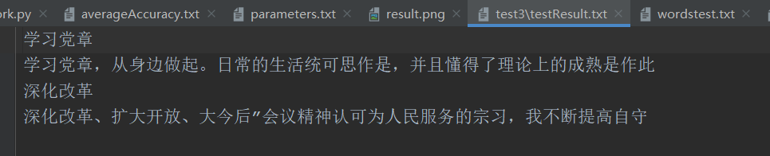 

#### 4) 模型四实验结果分析

+ 使用的样本为：辣椒引进四川进行种植并广泛运用于川菜烹调中，是古代川菜与近代川菜划分的一个分水岭，被视为近代川菜初现雏形的开始，这个时期大致在清朝初期的康熙时代。康熙二十七年（公元1688年）陈溴子撰写出版的《花镜》一书在第五卷有记载：“番椒，一名海疯藤，俗名辣茄……其味最辣，人多采用，研极细，冬月取以代胡椒。”这里的番椒，就是辣椒，也称海椒、秦椒等。而辣椒与蚕豆（即胡豆）的完美结合创制出的被誉为川菜灵魂的四川豆瓣被广泛运用于川菜烹调中，则被视为近代川菜形成的标志。豆瓣，俗称胡豆瓣，在品种繁多的四川豆瓣中，以郫县豆瓣最为著名。继而泡椒、泡菜、豆豉在川菜烹调中的革新运用，以及川菜三大类24种常用味型、54种烹调方法和3000余款经典传统名菜的形成，是近代川菜最终成型并成为中国四大菜系之首的标志，这个时间在民国中后期。两宋四川饮食的重大成就，就在于其烹饪开始被送到境外，让境外的川人和不是川人的普通人能在专门的食店里吃到具有地方特色的风味饮食，这是四川菜第一次成为一个独立的烹调体系的伊始。这就是所谓北宋的“川饭”，这些川饭店，主要经销“插肉面、大燠面、大小抹肉淘、煎燠肉、杂煎事件、生熟烧饭。”南宋的“川饭分茶”。从上述两书的内容可以发现，川菜出川主要经营大众化的饮食，尤其是面食，而面食里占主要成分的品种是面条，附带也有一些快餐类肉食。今日上海、杭州面条里的“燠面”或“沃面”很可能是川饭面条的遗存，因为我们在《东京梦华录》（写于南宋初年）里找不到第二处有记载燠面的地方，根据《都城纪胜.食店》，南渡以后的南食店和川饭分茶事实上成了面食店的代称，因此北宋开封川饭店的燠面在南渡一百五十年以后很可能变成一种固定的江南面条了。而我们知道，现代的燠面已经和现代川菜面条大不一样了。这些烹调的具体调味特色，而且没有发现其厚味、辛香的特色。从《梦梁录》的说明中，我们知道川饭的出现原因是，在北宋时期，为照顾在汴京居住的蜀中士大夫的口味，“谓其不便北食故耳。”南渡一百五十年以后，这些随南渡开设到临安的川饭店，已经“无南北之分矣”，说明这些川味面食曾与中原烹调有较大差异。
+ 在使用该样本对模型进行训练时，迭代次数设置为**200000**次，每迭代**500**次记录一次准确率的值。下面是随着迭代次数的增加，**准确率的部分变化过程**：

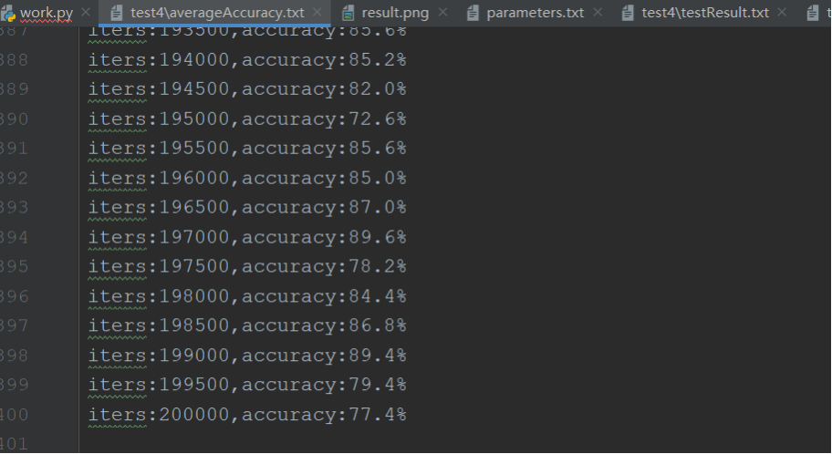 

+ 为了直观表示准确率的走向，本次实验绘制了**准确率走势的折线图**：

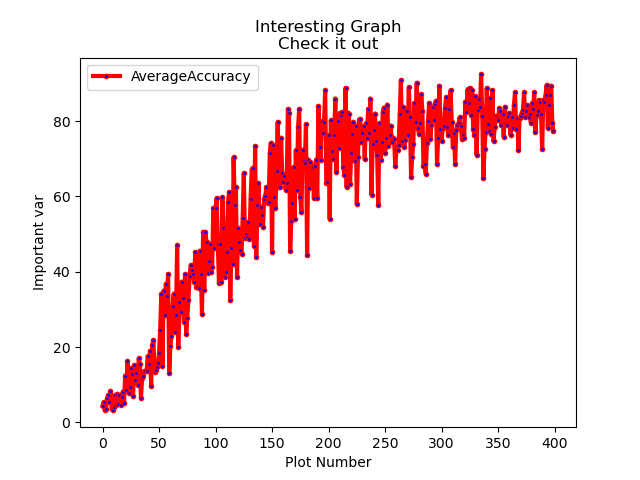 

+ 使用本样本对模型训练，在**迭代200000次准确率达到了77.4%**，认为模型可用，开始使用该模型进行预测。
+ 本次实验中**使用该模型进行了两次预测，**向训练好的模型输入文字“川菜形成”和“四大菜系”，模型相应的**预测结果**如下图。从预测结果看，模型准确率不是很高，而且模型不太稳定，因此在对文字进行预测时，预测结果不太好，但是与模型三对比来看，两个模型的训练样本差不多大，迭代相同次数后的准确率也差不多，因此可以通过加大迭代次数进一步优化模型从而得到更好的预测结果，考虑到现实因素，本次实验没有进一步优化。

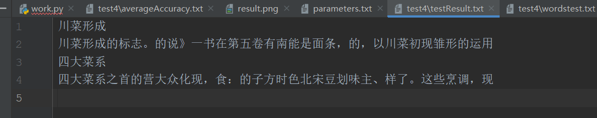 


 